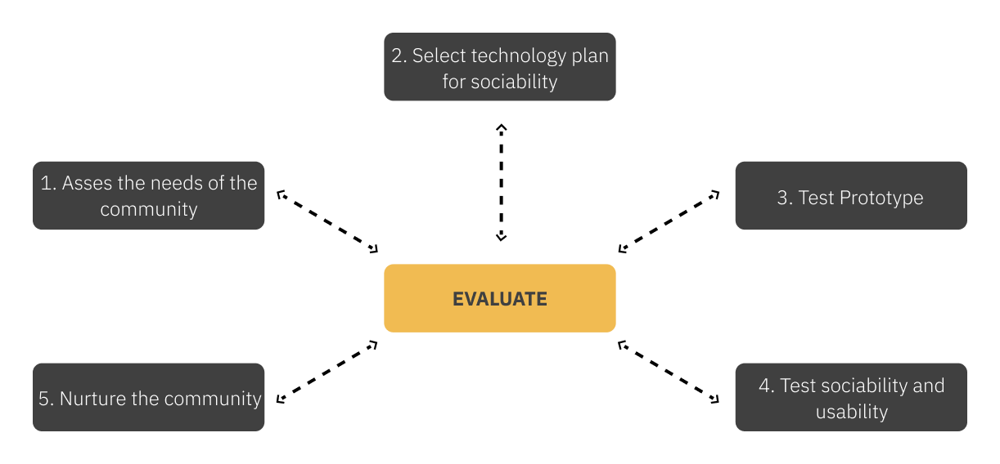
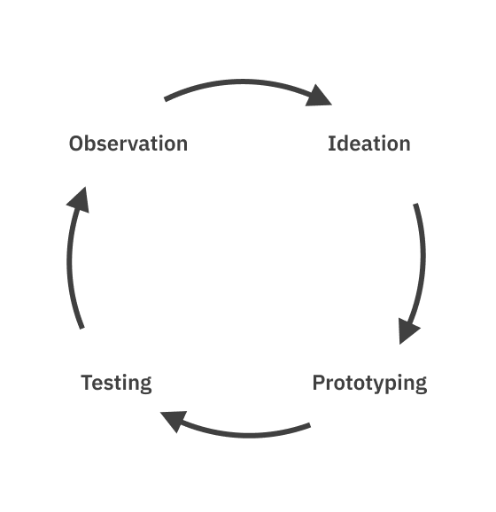
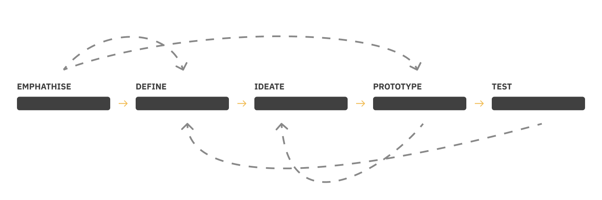

# Design Methods

After discussing the design principles necessary for a good user experience, this section elaborates on specific ways to approach the design process.

## Community-Centered Design

It is important to provide members within a community the opportunity to interact with each other (PREECES, 2004, P. 3FF). According to Preece, developing online communities is different from designing software as software, once shipped, is stable and does not change until the next update while online communities develop and change through dynamic interactions. It is first and foremost a social experience that changes according to who is participating, the number of people involved, and the type of discussion that takes place (IBID., P.4). For example, the dynamics between new and long-established communities differ notably. While the software might not change drastically, social interactions will adapt according to the growth of the community. This social adaption is called “sociability” (IBID.).

In many online communities, these social changes are at least as influential as software changes. Therefore, crucial to not only focus on the usability of the design but also on sociability. Therefore, knowledge from different disciplines such as sociology, social psychology, anthropology, as well as user-centered design is required (IBID.). In participatory community-centered design methodology (→ FIG. 07), members of the community are involved in the design process from the beginning. In community-centered design, six phases are each followed by an evaluation period and iterations based on the findings.

Assess the Needs of the Community
: The first step involves understanding the community. This means understanding the community’s needs. It is important to understand who the members of the community are and what the main purpose of the community is. It is about understanding for whom this community exists and what the participants’ habits are (PREECE, 2004, P. 4).

Select a Technology Plan for Sociability
: After understanding the potential members of the community, it is important to select the technology for communication within the community. Suitable mediums, such as timelines, discussion boards, or chat areas, must be discussed and the software should be tailored to suit the needs of the community (PREECE, 2004, P. 4F.).

Test Prototype
: Step three requires testing of the prototype with the potential members of the community. The intended software and sociability structures need to be validated at a basic level. This validation includes the representation of social policies and social interactions. For example, if members must complete a registration policy before joining the community, its comprehensibility must be ensured. In this step, iterative changes are made according to the user feedback (PREECE, 2004, P. 5).

Test Sociability and Usability
: Step four extends the testing made in step three and focuses on validating the design choices for good user experience and sociability. The usability, user interface, and the feel of the interaction are tested with the user. At this stage, substantial emphasis is laid on the overall user experience. (PREECE, 2004, P. 5).

Nurture the Community
: After establishing the basis for the online community, the final step consists of nurturing the community. It is the most important process as long as the community exists, since nurturing the community allows new members to feel welcomed and supported, thus enabling growth. Furthermore, the community must be well advertised, so that this growth can continue over a long period of time (PREECE, 2004, P. 5F.).

A community-centered design process is crucial to a community’s life cycle, as it ensures that members of respective communities are heard. This assurance allows the design to adapt and change based on their ideas, desires, and needs. Designing for online communities is iterative by nature and should reflect the community’s evolution (IBID., P. 6).

## Human-Centered Design

A design process can be approached in numerous ways. The previously mentioned community-centered design process is tailored specifically towards online communities and how members interact with each other. The problem, however, is that factoring in the unanimous behavior of a large group may result in neglect of an individual’s personal experience with the product. A more personal and empathetic approach is that of human-centered design (HCD).

HCD factors in the emotional and psychological preferences of the individual. According to Norman, this approach that “puts human needs, capabilities, and behavior first, then designs to accommodate those needs, capabilities, and ways of behaving” (NORMAN, 2013, P. 8). HCD puts the individual experience with the product first, considering the whole user experience (IXDF - UCD, N.D.). Norman describes HCD as a philosophy that starts with understanding humans and their needs and difficulties through observation. Since people often do not realize their own needs, it is the designers’ responsibility to observe and define them (NORMAN, 2013, P. 9).

There are four different phases in HCD (→ FIG. 08).

Observation
: Observation is the phase in which the user’s situation and the underlying problem that needs to be solved are researched by the designers. To understand the people for whom the solution is intended, one must observe them in their daily lives to fully understand their environment, the daily problems they encounter, and their goals. Furthermore, the current market offer is explored to determine how the problem has been approached by others (NORMAN, 2013, P. 222F.).

Ideation
: Through ideation, potential solutions for the given problem are explored. Based on the insights gained in the research phase, various ideas are accumulated to select the best solution for the given problem. It is important that no idea is discarded or focused on too early, as creative variety is the essence of ideation (NORMAN, 2013, P. 226).

Prototyping
: After the ideas are prototyped, they become tangible so that they can be tested later. Since feedback is crucial in the early stages of the design process, prototypes contain only the core functionality of the product with the relevant components that need validation. Prototypes demonstrate the real product (NORMAN, 2013, P. 227F.).

Testing
: Testing the prototypes with real users who correspond closely to the target demographic uncovers weaknesses and strengths of the concept. Assumptions made up to this point can be confirmed or refuted. Furthermore, the insights gathered throughout this phase are used to shape the subsequent iterations, thus improving the solution in the process (NORMAN, 2013, P. 228F.).

These four phases are repeated constantly until the solution fulfills potential. HCD is an iterative process in which each iteration produces more insight, bringing the solution closer to its goal. The result is a product that resonates more deeply with the target audience (NORMAN, 2013 P. 229F.). HCD might also be called user-centered design (W3C - UCD, N.D.).

> »Human-centered design is a philosophy, not a precise set of methods, but one that assumes that innovation should start by getting close to users and observing their activities.«
> – Don Norman

## Design Thinking

Design thinking is a process that, similarly to HCD, is centered on the user. The difference, however, lies in its end goal. HCD is a creative approach that solves known problems by gaining a deep understanding of and empathy for the target demographic (IDEO, N.D.). According to Michael Burmester, the ultimate goal of HCD is to ensure high usability and good user experience with digital interfaces (BURMESTER, 2016). Design thinking, on the other hand, is a more general approach to innovation that is not restricted to digital products. It, thus, has a far wider range of application. According to IDEO, the end goal of design thinking is the creation of innovative products that allow “people [to] find the sweet spot of feasibility, viability and desirability while considering the real needs and desires of people” (IDEO, N.D.).

Similar to HCD, design thinking is not to be seen as a process or system that must be followed in a certain way but rather as a philosophy or mindset for how to approach human issues (AJ&SMART, 2018). According to the Hasso-Plattner-Institute of Design at Stanford (d.school), design thinking can be divided into five phases: empathize, define, ideate, prototype, and test (D.SCHOOL, N.D.) (→ FIG. 08).

Empathize
: For the design thinking process, it is first important to gain an empathic understanding of the user and the problem that needs to be solved. Therefore, it is crucial to research the users to really understand their needs, their objectives, their thoughts, their emotions, and their struggles. This can be achieved by observing the user, engaging with the user, or a combination of both (D.SCHOOL, N.D.).

Define
: The second stage is dedicated to defining the problem. This is accomplished by compiling information gained throughout the empathizing phase. This widespread information is then analyzed and synthesized to define the core problems of the user. Defining the problem through a problem statement will help during the design process to address the relevant problems at any given time without losing focus or straying from the main objective. Defining the problem is about bringing clarity and focus to the design process (D.SCHOOL, N.D.).

Ideate
: After gaining a solid understanding of the users and their problems, potential ideas for the identified problems are explored. Ideation is about pushing for the widest possible range of ideas to select the best solution for the given problem (D.SCHOOL, N.D.).

Prototype
: Prototyping involves experimentation and turning ideas into tangible products. A prototype is a scaled-down version of a product that incorporates the potential solutions identified in the previous stages. Prototypes are created to communicate ideas to users (D.SCHOOL, N.D.).

Test
: Testing the prototypes allows the designers to gain valuable feedback from real users. It is also another opportunity to understand the user, but unlike the initial empathize phase, the insights gained from the preceding phases facilitate a deeper and more realistic understanding of the user. This newfound empathy and knowledge can be used in subsequent iterations to refine a product to its maximum potential (D.SCHOOL, N.D.).

For the concept of this thesis, design thinking will be applied to find a creative solution on how to support the user’s participation in team sports. Based on that solution, HCD will guide the design process to ensure high-quality user experience and usability. Furthermore, the principles of community-centered design will be used to emphasize sociability throughout the concept.